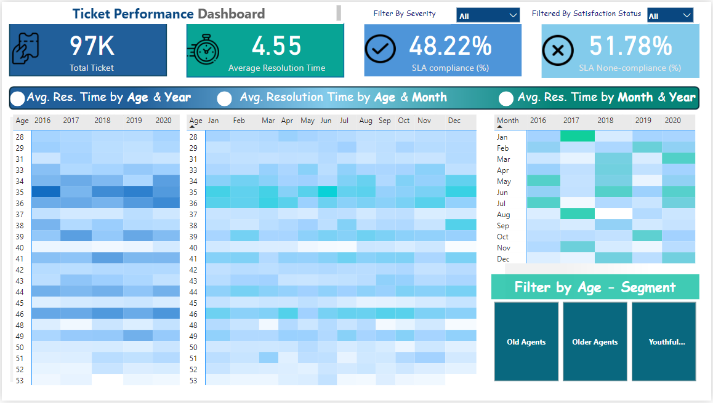

# Power BI Dashboard Creation with DAX - A Data Story

This project demonstrates a Power BI dashboard I created from scratch, inspired by a tutorial on the [Data with Decision] YouTube channel. Using DAX for advanced data analysis and visualization, this dashboard is designed to offer insights into key performance metrics for a retail company. The project showcases my data storytelling capabilities by turning raw data into meaningful, actionable insights that support business decision-making.

## Project Overview
- **Interactive Visuals**: The dashboard features drill-down capabilities that allow users to explore sales, revenue, and seasonal trends in-depth. It helps answer key questions like, "What are the primary drivers of sales?" and "How does seasonality impact revenue?"
- **Real-time Updates**: Configured for real-time updates, this dashboard ensures that users have access to the latest data, enabling timely and informed decisions.
- **Data Insights**: Through dynamic visualizations, the dashboard uncovers growth patterns and performance trends, helping users make strategic adjustments as needed.

## Skills Demonstrated
- **DAX (Data Analysis Expressions)**: Used for custom calculations, allowing for precise and flexible insights tailored to specific business needs.
- **Power BI Data Modeling**: Designed a structured data model for efficient processing and scalability of reports.
- **Data Visualization and Storytelling**: Applied data visualization techniques to guide users through a coherent data narrative, enhancing data accessibility and comprehension.

## Screenshots
Here’s a preview of the dashboard and some of its key visuals:
  
*Figure 1: Main Dashboard Overview*

## Usage
To view the full interactive dashboard, check out the Power BI report here: [Power BI Dashboard Link](https://bit.ly/4e8vwFe).

## Usage
1. **Download the `.pbix` File**: To explore the full dashboard, download the `Retail_Dashboard.pbix` file and open it in Power BI Desktop.
2. **Interact with Visuals**: Use the interactive features to drill down into specific periods, categories, and performance metrics, allowing for a hands-on data exploration experience.

## Results and Insights
The dashboard provides essential insights, including:
- Identification of top-performing products and categories, enabling strategic focus on high-impact areas.
- Visualization of seasonal trends, revealing peak sales periods and opportunities for targeted marketing.
- Detailed analysis capabilities, helping users pinpoint precise performance factors and adjust strategies proactively.

## Conclusion
This Power BI project highlights my proficiency in DAX and Power BI, demonstrating my ability to create interactive, insightful data visualizations for business use. Through this project, I’ve honed my skills in data analysis, real-time reporting, and performance tracking, all crucial for effective data-driven storytelling.

## Acknowledgments
Special thanks to [Data with Decision] for the guidance and inspiration in building this project!

---

Connect with me on [LinkedIn](https://www.linkedin.com/in/albiranousin) if you'd like to discuss this project or explore potential collaboration opportunities.
